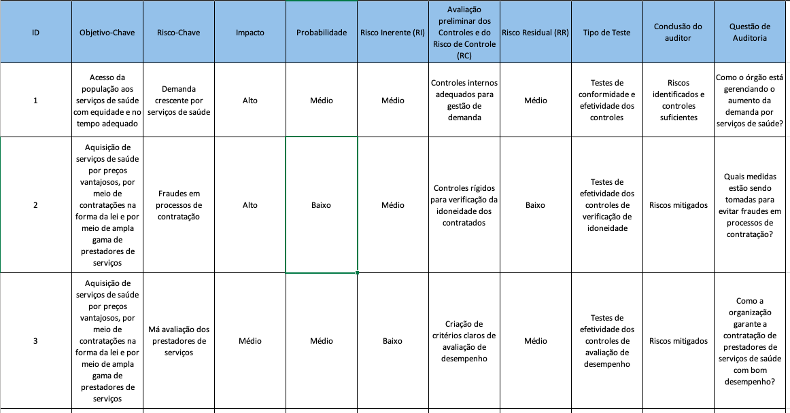

# 2. Como o Chat GPT pode ajudar nos trabalhos de auditoria.

*Observação: parte deste texto foi escrita pelo modelo gpt-3.5-turbo.*

## O que é o Chat GPT

O Chat GPT é um modelo de linguagem avançado desenvolvido pela OpenAI, baseado na arquitetura GPT-3.5. Ele é capaz de gerar texto de forma autônoma, a partir de dados de treinamento extensos, permitindo a compreensão e geração de linguagem natural de alta qualidade.

## O que são prompts?

Prompts são instruções ou perguntas fornecidas ao Chat GPT para direcionar sua resposta. Eles são a forma como os usuários interagem com o modelo, apresentando o contexto e solicitando informações específicas.

## Como construir prompts eficientes?

Para construir prompts eficientes, é importante ser claro, específico e conciso. Use linguagem objetiva e detalhes suficientes para orientar o Chat GPT sobre a tarefa desejada. Experimentar diferentes abordagens e ajustar os prompts com base nos resultados também pode melhorar a eficácia. Leia a conversa [3. Como construir prompts eficientes no ChatGPT ](conversa003-prompts-eficientes.md)

## O que é o Manual de Orientação Técnica da CGU?
O Manual de Orientação Técnica da CGU é é um documento elaborado para padronizar procedimentos, garantir a qualidade e a efetividade dos trabalhos de controle e fiscalização, e promover a disseminação de boas práticas na administração pública brasileira.

## Identificando Riscos

No contexto de auditoria, a identificação de riscos é fundamental para garantir que os potenciais problemas sejam identificados e tratados adequadamente. O Chat GPT pode auxiliar os auditores ao analisar dados e cenários para detectar possíveis riscos e áreas de atenção.

O Chat GPT pode apoiar os auditores governamentais a criar os principais documentos artefatos de auditoria, como exemplo os citados a seguir:

## Matriz de Identificação e Análise dos Riscos

Exemplo de prompt para identificação de análise de riscos:

```
Segundo o Manual de Orientação Técnica da CGU, a etapa de identificação e análise de riscos tem como objetivo identificar quais riscos podem influenciar o cumprimento dos objetivos do objeto da auditoria; verificar as causas e consequências desses riscos; classificá-los e, ainda, identificar e avaliar a adequação do desenho dos controles internos da gestão, de forma a concluir sobre quais riscos e controles deverão ser analisados prioritariamente.

A Matriz de Identificação e Análise dos Riscos é formada pelos seguintes campos:

Campos:
Objetivos-chave; Evento de Risco; Fonte do Risco; Possíveis Causas; Possíveis Consequências; Controles Previstos

Descrição dos Campos:
Objetivos-chave: Identificar no fluxo os principais objetivos.
Evento de Risco: Identificar os riscos relacionados ao respectivo objetivo.
Fonte do Risco: Pessoas, Processos, Sistemas, Infraestrutura Física, Tecnologia, Governança, Planejamento, Eventos externos
Possíveis Consequências: Identificar possíveis consequências relacionados ao risco.
Controles Previstos: Analisar os respectivos controles internos (respostas aos riscos) que a gestão adota para gerenciar o risco.

Com base no modelo proposto, preencha os demais campos da Matriz de Identificação e Análise dos Riscos para os seguintes objetivos-chave. A resposta deverá ser em português e os campos separados por ponto-e-vírgula. 

Objetivos-Chave:
1. Acesso da população aos serviços de saúde com equidade e no tempo adequado.
2. Aquisição de serviços de saúde por preços vantajosos, por meio de contratações na forma da lei e por meio de ampla gama de prestadores de serviços.

Formate a resposta separada por ";" para ser copiada e colada diretamente em um arquivo csv.
```


## Matriz de Riscos e Controles

Exemplo de prompt para construção de Matriz de Riscos e Controles.

```
Segundo o Manual de Orientação Técnica da CGU, a etapa de identificação e análise de riscos tem como objetivo identificar quais riscos podem influenciar o cumprimento dos objetivos do objeto da auditoria; verificar as causas e consequências desses riscos; classificá-los e, ainda, identificar e avaliar a adequação do desenho dos controles internos da gestão, de forma a concluir sobre quais riscos e controles deverão ser analisados prioritariamente.

A Matriz de Riscos e Controles é formada pelos seguintes campos:
ID; Objetivo-Chave; Risco-Chave; Impacto; Probabilidade; Risco Inerente (RI); Avaliação preliminar dos Controles e do Risco
de Controle (RC); Risco Residual (RR); Tipo de Teste; Conclusão do auditor; Questão de Auditoria.

A descrição de cada um desses campos é a seguinte:
ID: Identificador.
Objetivo-Chave: Identificar no fluxo os principais objetivos.
Risco-Chave: Identificado na etapa anterior e alimentado automaticamente.
Impacto: Avaliar o impacto do risco com base nos critérios de Impacto.
Probabilidade: Avaliar a probabilidade do risco com base nos critérios de probabilidade.
Risco Inerente (RI): Risco a que uma organização está exposta sem considerar quaisquer ações gerenciais que possam reduzir a probabilidade de sua ocorrência ou seu impacto; Avaliação de RI com base nos níveis de riscos.
Avaliação preliminar dos Controles e do Risco de Controle (RC): Avaliação dos controles desenhados para o respectivo risco; Descrição da avaliação do controle risco de que um erro ou classificação indevida materiais que possam constar de uma afirmação não sejam evitados ou detectados tempestivamente pelos controles internos da entidade.
Risco Residual (RR): Risco que permanece após a resposta da administração. É resultado da multiplicação RI x RC; Avaliação do Risco Residual com base na escala de Avaliação dos Níveis de Risco.
Tipo de Teste: Tipos de testes de auditoria que serão necessários, com base na avaliação dos controles.
Conclusão do auditor: Conclusão do auditor sobre os riscos a serem priorizados e os tipos de testes a serem aplicados
Questão de Auditoria: Elemento que define o objetivo da auditoria e constitui a base da estrutura das análises que permitirão chegar à conclusão sobre os controles: se estão adequadamente concebidos na proporção requerida pelos riscos; se estão sendo aplicados e se funcionam de maneira contínua e coerente, conforme as respostas a riscos definidas pela administração.

Com base no modelo proposto, preencha os demais campos Matriz de Riscos e Controle a partir dos os seguintes Objetivo-Chave e Risco-Chave. A resposta deverá ser em português e os campos separados por ponto-e-vírgula.

Objetivo-chave; Risco-Chave
1 - Acesso da população aos serviços de saúde com equidade e no tempo adequado;	Demanda crescente por serviços de saúde
1 - Acesso da população aos serviços de saúde com equidade e no tempo adequado;	Falta de infraestrutura adequada
1 - Acesso da população aos serviços de saúde com equidade e no tempo adequado;	Má gestão dos recursos humanos
2 - Aquisição de serviços de saúde por preços vantajosos, por meio de contratações na forma da lei e por meio de ampla gama de prestadores de serviços;	Fraudes em processos de contratação
2 - Aquisição de serviços de saúde por preços vantajosos, por meio de contratações na forma da lei e por meio de ampla gama de prestadores de serviços;	Má avaliação dos prestadores de serviços
2 - Aquisição de serviços de saúde por preços vantajosos, por meio de contratações na forma da lei e por meio de ampla gama de prestadores de serviços;	Condições contratuais desfavoráveis

Formate a resposta separada por ";" para ser copiada e colada diretamente em um arquivo csv.
```

A resposta no ChatGPT deve ficar neste formato. Senão, copie e cole novamente a frase:

`Formate a resposta separada por ";" para ser copiada e colada diretamente em um arquivo csv.`


Segue um exemplo de como ficou o resultado depois de copiado e colado no excel:



## Relatoria dos Achados

Após a realização dos testes, o Chat GPT pode auxiliar na elaboração da relatoria dos achados, transformando dados brutos em informações bem estruturadas e de fácil compreensão. Isso facilita a comunicação dos resultados e recomendações aos gestores das unidades auditadas.

## Catalogando Evidências

O Chat GPT pode ser uma ferramenta útil para organizar e catalogar as evidências obtidas durante a auditoria. Com sua capacidade de processar informações, classificar dados e criar resumos, a catalogação das evidências torna-se mais eficiente e acessível.

## O que está por debaixo do "capô" do Chat GPT

O Chat GPT é alimentado por uma rede neural profunda, que usa técnicas de aprendizado de máquina para entender padrões nos dados de treinamento e gerar respostas coerentes. A arquitetura GPT-3.5 possui 175 bilhões de parâmetros, permitindo uma grande capacidade de processamento e geração de texto de alta qualidade. Por trás do Chat GPT, existem poderosos servidores e algoritmos que garantem seu funcionamento confiável e eficiente.
